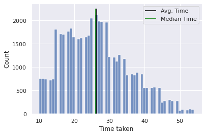

# Data Exploration


```python
import numpy as np
import pandas as pd
import seaborn as sns
sns.set_theme()
```

## Load data


```python
df = pd.read_csv("deliverytime.csv")

print(df.columns)

df.describe()
```

    Index(['ID', 'Delivery_person_ID', 'Delivery_person_Age',
           'Delivery_person_Ratings', 'Restaurant_latitude',
           'Restaurant_longitude', 'Delivery_location_latitude',
           'Delivery_location_longitude', 'Type_of_order', 'Type_of_vehicle',
           'Time_taken(min)'],
          dtype='object')


<div>
<style scoped>
    .dataframe tbody tr th:only-of-type {
        vertical-align: middle;
    }

    .dataframe tbody tr th {
        vertical-align: top;
    }

    .dataframe thead th {
        text-align: right;
    }
</style>
<table border="1" class="dataframe">
  <thead>
    <tr style="text-align: right;">
      <th></th>
      <th>Delivery_person_Age</th>
      <th>Delivery_person_Ratings</th>
      <th>Restaurant_latitude</th>
      <th>Restaurant_longitude</th>
      <th>Delivery_location_latitude</th>
      <th>Delivery_location_longitude</th>
      <th>Time_taken(min)</th>
    </tr>
  </thead>
  <tbody>
    <tr>
      <th>count</th>
      <td>45593.000000</td>
      <td>45593.000000</td>
      <td>45593.000000</td>
      <td>45593.000000</td>
      <td>45593.000000</td>
      <td>45593.000000</td>
      <td>45593.000000</td>
    </tr>
    <tr>
      <th>mean</th>
      <td>29.544075</td>
      <td>4.632367</td>
      <td>17.017729</td>
      <td>70.231332</td>
      <td>17.465186</td>
      <td>70.845702</td>
      <td>26.294607</td>
    </tr>
    <tr>
      <th>std</th>
      <td>5.696793</td>
      <td>0.327708</td>
      <td>8.185109</td>
      <td>22.883647</td>
      <td>7.335122</td>
      <td>21.118812</td>
      <td>9.383806</td>
    </tr>
    <tr>
      <th>min</th>
      <td>15.000000</td>
      <td>1.000000</td>
      <td>-30.905562</td>
      <td>-88.366217</td>
      <td>0.010000</td>
      <td>0.010000</td>
      <td>10.000000</td>
    </tr>
    <tr>
      <th>25%</th>
      <td>25.000000</td>
      <td>4.600000</td>
      <td>12.933284</td>
      <td>73.170000</td>
      <td>12.988453</td>
      <td>73.280000</td>
      <td>19.000000</td>
    </tr>
    <tr>
      <th>50%</th>
      <td>29.000000</td>
      <td>4.700000</td>
      <td>18.546947</td>
      <td>75.898497</td>
      <td>18.633934</td>
      <td>76.002574</td>
      <td>26.000000</td>
    </tr>
    <tr>
      <th>75%</th>
      <td>34.000000</td>
      <td>4.800000</td>
      <td>22.728163</td>
      <td>78.044095</td>
      <td>22.785049</td>
      <td>78.107044</td>
      <td>32.000000</td>
    </tr>
    <tr>
      <th>max</th>
      <td>50.000000</td>
      <td>6.000000</td>
      <td>30.914057</td>
      <td>88.433452</td>
      <td>31.054057</td>
      <td>88.563452</td>
      <td>54.000000</td>
    </tr>
  </tbody>
</table>
</div>


Some of the column names aren't great (e.g. "Time_taken(min)"). Let's rename them first.


```python
cols = df.columns.tolist()
cols[-1] = "time_taken"
cols = [col.lower() for col in cols]
df.columns = cols
print(cols)
```

    ['id', 'delivery_person_id', 'delivery_person_age', 'delivery_person_ratings', 'restaurant_latitude', 'restaurant_longitude', 'delivery_location_latitude', 'delivery_location_longitude', 'type_of_order', 'type_of_vehicle', 'time_taken']


## Missing values


```python
df.isnull().sum()
```


    id                             0
    delivery_person_id             0
    delivery_person_age            0
    delivery_person_ratings        0
    restaurant_latitude            0
    restaurant_longitude           0
    delivery_location_latitude     0
    delivery_location_longitude    0
    type_of_order                  0
    type_of_vehicle                0
    time_taken                     0
    dtype: int64


There are no missing values present in the dataset, so there is no need to impute or to drop any columns or rows.

## Dependent variable


```python
avg_time = df.time_taken.mean()
median_time = df.time_taken.median()
print(f"Average delivery time: {avg_time}")
print(f"Median delivery time: {median_time}")
hist = sns.histplot(df.time_taken)
hist.vlines(avg_time, 0, 2250, color = "black", label = "Avg. Time")
hist.vlines(median_time, 0, 2250, color = "green", label = "Median Time")
hist.set(xlabel = "Time taken")
hist.legend()
```

    Average delivery time: 26.29460662821047
    Median delivery time: 26.0


    <matplotlib.legend.Legend at 0x7f9698cf5580>


    

    


The distribution has a positive skew, and the mean is slightly above the median. The fastest deliveries take only ten minutes, the slowest 54 minutes.

## Categorical independent variables


```python
cat_cols = df.select_dtypes(include='object')
cat_cols.head()
```


<div>
<style scoped>
    .dataframe tbody tr th:only-of-type {
        vertical-align: middle;
    }

    .dataframe tbody tr th {
        vertical-align: top;
    }

    .dataframe thead th {
        text-align: right;
    }
</style>
<table border="1" class="dataframe">
  <thead>
    <tr style="text-align: right;">
      <th></th>
      <th>id</th>
      <th>delivery_person_id</th>
      <th>type_of_order</th>
      <th>type_of_vehicle</th>
    </tr>
  </thead>
  <tbody>
    <tr>
      <th>0</th>
      <td>4607</td>
      <td>INDORES13DEL02</td>
      <td>Snack</td>
      <td>motorcycle</td>
    </tr>
    <tr>
      <th>1</th>
      <td>B379</td>
      <td>BANGRES18DEL02</td>
      <td>Snack</td>
      <td>scooter</td>
    </tr>
    <tr>
      <th>2</th>
      <td>5D6D</td>
      <td>BANGRES19DEL01</td>
      <td>Drinks</td>
      <td>motorcycle</td>
    </tr>
    <tr>
      <th>3</th>
      <td>7A6A</td>
      <td>COIMBRES13DEL02</td>
      <td>Buffet</td>
      <td>motorcycle</td>
    </tr>
    <tr>
      <th>4</th>
      <td>70A2</td>
      <td>CHENRES12DEL01</td>
      <td>Snack</td>
      <td>scooter</td>
    </tr>
  </tbody>
</table>
</div>


There are four categorical variables: delivery id, delivery person id, the type of order and the type of vehicle. The id is largely meaningless and can be dropped first.


```python
cat_cols.drop("id", axis = 1, inplace = True)
```

### Type of order


```python
print(f"Number of unique order types: {cat_cols.type_of_order.nunique()}")
cat_cols.type_of_order.unique().tolist()
```

    Number of unique order types: 4


    ['Snack ', 'Drinks ', 'Buffet ', 'Meal ']


The categories have superfluous whitespaces at the end of the string. These are removed first.


```python
cat_cols["type_of_order"] = [cell.strip() for cell in cat_cols.type_of_order]
```


```python
sns.boxplot(x = df.type_of_order, y = df.time_taken)
```


    <AxesSubplot:xlabel='type_of_order', ylabel='time_taken'>


    

    


```python
df.groupby("type_of_order")["time_taken"].describe()
```


<div>
<style scoped>
    .dataframe tbody tr th:only-of-type {
        vertical-align: middle;
    }

    .dataframe tbody tr th {
        vertical-align: top;
    }

    .dataframe thead th {
        text-align: right;
    }
</style>
<table border="1" class="dataframe">
  <thead>
    <tr style="text-align: right;">
      <th></th>
      <th>count</th>
      <th>mean</th>
      <th>std</th>
      <th>min</th>
      <th>25%</th>
      <th>50%</th>
      <th>75%</th>
      <th>max</th>
    </tr>
    <tr>
      <th>type_of_order</th>
      <th></th>
      <th></th>
      <th></th>
      <th></th>
      <th></th>
      <th></th>
      <th></th>
      <th></th>
    </tr>
  </thead>
  <tbody>
    <tr>
      <th>Buffet</th>
      <td>11280.0</td>
      <td>26.283511</td>
      <td>9.411344</td>
      <td>10.0</td>
      <td>19.0</td>
      <td>26.0</td>
      <td>32.0</td>
      <td>54.0</td>
    </tr>
    <tr>
      <th>Drinks</th>
      <td>11322.0</td>
      <td>26.187953</td>
      <td>9.298465</td>
      <td>10.0</td>
      <td>19.0</td>
      <td>25.0</td>
      <td>32.0</td>
      <td>54.0</td>
    </tr>
    <tr>
      <th>Meal</th>
      <td>11458.0</td>
      <td>26.419270</td>
      <td>9.424849</td>
      <td>10.0</td>
      <td>19.0</td>
      <td>26.0</td>
      <td>33.0</td>
      <td>54.0</td>
    </tr>
    <tr>
      <th>Snack</th>
      <td>11533.0</td>
      <td>26.286309</td>
      <td>9.399147</td>
      <td>10.0</td>
      <td>19.0</td>
      <td>26.0</td>
      <td>32.0</td>
      <td>54.0</td>
    </tr>
  </tbody>
</table>
</div>


Meals tend to take slightly longer to deliver, but the difference isn't large.

### Type of vehicle


```python
print(f"Number of unique vehicle types: {cat_cols.type_of_vehicle.nunique()}")
cat_cols.type_of_vehicle.unique().tolist()
```

    Number of unique vehicle types: 4


    ['motorcycle ', 'scooter ', 'electric_scooter ', 'bicycle ']


```python
cat_cols["type_of_vehicle"] = [cell.strip() for cell in cat_cols.type_of_vehicle]
```


```python
sns.boxplot(x = df.type_of_vehicle, y = df.time_taken)
```


    <AxesSubplot:xlabel='type_of_vehicle', ylabel='time_taken'>


    

    


```python
df.groupby("type_of_vehicle")["time_taken"].describe()
```


<div>
<style scoped>
    .dataframe tbody tr th:only-of-type {
        vertical-align: middle;
    }

    .dataframe tbody tr th {
        vertical-align: top;
    }

    .dataframe thead th {
        text-align: right;
    }
</style>
<table border="1" class="dataframe">
  <thead>
    <tr style="text-align: right;">
      <th></th>
      <th>count</th>
      <th>mean</th>
      <th>std</th>
      <th>min</th>
      <th>25%</th>
      <th>50%</th>
      <th>75%</th>
      <th>max</th>
    </tr>
    <tr>
      <th>type_of_vehicle</th>
      <th></th>
      <th></th>
      <th></th>
      <th></th>
      <th></th>
      <th></th>
      <th></th>
      <th></th>
    </tr>
  </thead>
  <tbody>
    <tr>
      <th>bicycle</th>
      <td>68.0</td>
      <td>26.426471</td>
      <td>9.262855</td>
      <td>10.0</td>
      <td>19.0</td>
      <td>26.0</td>
      <td>32.25</td>
      <td>47.0</td>
    </tr>
    <tr>
      <th>electric_scooter</th>
      <td>3814.0</td>
      <td>24.470110</td>
      <td>8.610859</td>
      <td>10.0</td>
      <td>17.0</td>
      <td>24.0</td>
      <td>30.00</td>
      <td>53.0</td>
    </tr>
    <tr>
      <th>motorcycle</th>
      <td>26435.0</td>
      <td>27.605674</td>
      <td>9.647811</td>
      <td>10.0</td>
      <td>20.0</td>
      <td>26.0</td>
      <td>34.00</td>
      <td>54.0</td>
    </tr>
    <tr>
      <th>scooter</th>
      <td>15276.0</td>
      <td>24.480754</td>
      <td>8.704238</td>
      <td>10.0</td>
      <td>17.0</td>
      <td>24.0</td>
      <td>30.00</td>
      <td>54.0</td>
    </tr>
  </tbody>
</table>
</div>


Deliveries brought by motorcycle or bicycle tend to take longer to deliver. This doesn't necessarily have to be a causal relationship. It could simply be that motorcycles are used to reach destinations that are farther away. It's also of note that only very few deliveries are done by bicycle, so the summary statistics might not be very meaningful in this case.

### Delivery person


```python
print(f"Number of unique delivery person ids: {cat_cols.delivery_person_id.nunique()}")
```

    Number of unique delivery person ids: 1320


```python
person_id_table = cat_cols.delivery_person_id.value_counts()
person_id_table.describe()
```


    count    1320.000000
    mean       34.540152
    std        21.305850
    min         5.000000
    25%        13.000000
    50%        41.000000
    75%        56.000000
    max        67.000000
    Name: delivery_person_id, dtype: float64


The average delivery person has carried out 34.5 deliveries. The delivery person with the fewest number of deliveries has 5, while the most active delivery person has 67 deliveries under their belt. Considering the high number of delivery persons and the relatively few deliveries per person, dummifying this variable might be more trouple than it is worth. It is dropped for now.


```python
cat_cols.drop("delivery_person_id", axis = 1, inplace = True)
```

### Dummifying

The type of vehicle and the type of order have relatively few unique categories and they might have a relation to the outcome variable. These two variables will be dummified, while the other two variables (order ID and delivery person ID) have been dropped.


```python
cat_cols_dummy = pd.get_dummies(cat_cols)
print(cat_cols_dummy.columns)
```

    Index(['type_of_order_Buffet', 'type_of_order_Drinks', 'type_of_order_Meal',
           'type_of_order_Snack', 'type_of_vehicle_bicycle',
           'type_of_vehicle_electric_scooter', 'type_of_vehicle_motorcycle',
           'type_of_vehicle_scooter'],
          dtype='object')


For each variable, the first category is dropped and used as reference category. In the case of the type of order, the category I've chosen as reference is "Drinks" as they are easy to prepare and slightly faster to deliver. The type of vehicle chosen as the reference category is "Motorcyle" because they are most frequently used.


```python
cat_cols_dummy.drop(["type_of_order_Drinks", "type_of_vehicle_motorcycle"], axis = 1, inplace = True)
cat_cols_dummy.head()
```


<div>
<style scoped>
    .dataframe tbody tr th:only-of-type {
        vertical-align: middle;
    }

    .dataframe tbody tr th {
        vertical-align: top;
    }

    .dataframe thead th {
        text-align: right;
    }
</style>
<table border="1" class="dataframe">
  <thead>
    <tr style="text-align: right;">
      <th></th>
      <th>type_of_order_Buffet</th>
      <th>type_of_order_Meal</th>
      <th>type_of_order_Snack</th>
      <th>type_of_vehicle_bicycle</th>
      <th>type_of_vehicle_electric_scooter</th>
      <th>type_of_vehicle_scooter</th>
    </tr>
  </thead>
  <tbody>
    <tr>
      <th>0</th>
      <td>0</td>
      <td>0</td>
      <td>1</td>
      <td>0</td>
      <td>0</td>
      <td>0</td>
    </tr>
    <tr>
      <th>1</th>
      <td>0</td>
      <td>0</td>
      <td>1</td>
      <td>0</td>
      <td>0</td>
      <td>1</td>
    </tr>
    <tr>
      <th>2</th>
      <td>0</td>
      <td>0</td>
      <td>0</td>
      <td>0</td>
      <td>0</td>
      <td>0</td>
    </tr>
    <tr>
      <th>3</th>
      <td>1</td>
      <td>0</td>
      <td>0</td>
      <td>0</td>
      <td>0</td>
      <td>0</td>
    </tr>
    <tr>
      <th>4</th>
      <td>0</td>
      <td>0</td>
      <td>1</td>
      <td>0</td>
      <td>0</td>
      <td>1</td>
    </tr>
  </tbody>
</table>
</div>


## Numeric independent variables

### Distance

The variables 'restaurant_latitude', 'restaurant_longitude', 'delivery_location_latitude', 'delivery_location_longitude' can be used to calculate beeline location. Of course, delivery drivers can't drive in a straight line to their location, but calculating exact distance would be much more difficult. So this is still a good enough approximation.

But first, there seem to be both negative and positive values in the data. Either these locations are very far apart, or there is some error in the data.


```python
df.loc[df.restaurant_latitude < 0, :]
```


<div>
<style scoped>
    .dataframe tbody tr th:only-of-type {
        vertical-align: middle;
    }

    .dataframe tbody tr th {
        vertical-align: top;
    }

    .dataframe thead th {
        text-align: right;
    }
</style>
<table border="1" class="dataframe">
  <thead>
    <tr style="text-align: right;">
      <th></th>
      <th>id</th>
      <th>delivery_person_id</th>
      <th>delivery_person_age</th>
      <th>delivery_person_ratings</th>
      <th>restaurant_latitude</th>
      <th>restaurant_longitude</th>
      <th>delivery_location_latitude</th>
      <th>delivery_location_longitude</th>
      <th>type_of_order</th>
      <th>type_of_vehicle</th>
      <th>time_taken</th>
    </tr>
  </thead>
  <tbody>
    <tr>
      <th>92</th>
      <td>C042</td>
      <td>AGRRES010DEL01</td>
      <td>34</td>
      <td>4.7</td>
      <td>-27.163303</td>
      <td>78.057044</td>
      <td>27.233303</td>
      <td>78.127044</td>
      <td>Drinks</td>
      <td>scooter</td>
      <td>15</td>
    </tr>
    <tr>
      <th>283</th>
      <td>C044</td>
      <td>AGRRES12DEL03</td>
      <td>32</td>
      <td>4.7</td>
      <td>-27.165108</td>
      <td>78.015053</td>
      <td>27.225108</td>
      <td>78.075053</td>
      <td>Meal</td>
      <td>scooter</td>
      <td>31</td>
    </tr>
    <tr>
      <th>289</th>
      <td>4DB</td>
      <td>PUNERES02DEL03</td>
      <td>29</td>
      <td>4.6</td>
      <td>-18.551440</td>
      <td>-73.804855</td>
      <td>18.611440</td>
      <td>73.864855</td>
      <td>Meal</td>
      <td>scooter</td>
      <td>12</td>
    </tr>
    <tr>
      <th>425</th>
      <td>C003</td>
      <td>DEHRES13DEL02</td>
      <td>29</td>
      <td>4.6</td>
      <td>-30.366322</td>
      <td>-78.070453</td>
      <td>30.496322</td>
      <td>78.200453</td>
      <td>Snack</td>
      <td>scooter</td>
      <td>20</td>
    </tr>
    <tr>
      <th>534</th>
      <td>473</td>
      <td>MYSRES07DEL03</td>
      <td>29</td>
      <td>4.6</td>
      <td>-12.325461</td>
      <td>-76.632278</td>
      <td>12.385461</td>
      <td>76.692278</td>
      <td>Buffet</td>
      <td>scooter</td>
      <td>16</td>
    </tr>
    <tr>
      <th>...</th>
      <td>...</td>
      <td>...</td>
      <td>...</td>
      <td>...</td>
      <td>...</td>
      <td>...</td>
      <td>...</td>
      <td>...</td>
      <td>...</td>
      <td>...</td>
      <td>...</td>
    </tr>
    <tr>
      <th>44933</th>
      <td>C0C2</td>
      <td>AURGRES03DEL03</td>
      <td>30</td>
      <td>4.9</td>
      <td>-19.874733</td>
      <td>75.353942</td>
      <td>19.904733</td>
      <td>75.383942</td>
      <td>Buffet</td>
      <td>motorcycle</td>
      <td>15</td>
    </tr>
    <tr>
      <th>45020</th>
      <td>56B</td>
      <td>PUNERES04DEL01</td>
      <td>29</td>
      <td>4.6</td>
      <td>-18.514210</td>
      <td>73.838429</td>
      <td>18.524210</td>
      <td>73.848429</td>
      <td>Drinks</td>
      <td>electric_scooter</td>
      <td>30</td>
    </tr>
    <tr>
      <th>45108</th>
      <td>C01B</td>
      <td>GOARES18DEL01</td>
      <td>29</td>
      <td>4.6</td>
      <td>-15.493950</td>
      <td>-73.827423</td>
      <td>15.563950</td>
      <td>73.897423</td>
      <td>Meal</td>
      <td>scooter</td>
      <td>19</td>
    </tr>
    <tr>
      <th>45182</th>
      <td>C0C7</td>
      <td>KNPRES16DEL02</td>
      <td>30</td>
      <td>4.0</td>
      <td>-26.482581</td>
      <td>80.315628</td>
      <td>26.532581</td>
      <td>80.365628</td>
      <td>Drinks</td>
      <td>motorcycle</td>
      <td>34</td>
    </tr>
    <tr>
      <th>45504</th>
      <td>461</td>
      <td>BANGRES07DEL02</td>
      <td>29</td>
      <td>4.6</td>
      <td>-12.978453</td>
      <td>-77.643685</td>
      <td>12.998453</td>
      <td>77.663685</td>
      <td>Meal</td>
      <td>scooter</td>
      <td>24</td>
    </tr>
  </tbody>
</table>
<p>431 rows × 11 columns</p>
</div>


As we can see here, the absolute vale of the restaurant latitude seems to be very close to delivery location latitude. As it is highly unlikely that the delivery has crossed the equator or the prime meridian, the values have to be corrected. The locations are likely all in India (for example, [30.496322, 78.200453] is in Uttarakhand), so both positive latitude and positive longitude is assumed.

There are also many restaurants with a location of (0, 0). 


```python
tmp = df.loc[df.restaurant_latitude == 0, :]

print(tmp.delivery_location_latitude.describe())
print(tmp.delivery_location_longitude.describe())
```

    count    3640.000000
    mean        0.063016
    std         0.036047
    min         0.010000
    25%         0.030000
    50%         0.060000
    75%         0.090000
    max         0.130000
    Name: delivery_location_latitude, dtype: float64
    count    3640.000000
    mean        0.063016
    std         0.036047
    min         0.010000
    25%         0.030000
    50%         0.060000
    75%         0.090000
    max         0.130000
    Name: delivery_location_longitude, dtype: float64


In these cases, the delivery location latitude and longitude are all positive and closeby.

The absolute value of all location variables should be taken.


```python
df["restaurant_latitude"] = df["restaurant_latitude"].abs()
df["restaurant_longitude"] = df["restaurant_longitude"].abs()
df["delivery_location_latitude"] = df["delivery_location_latitude"].abs()
df["delivery_location_longitude"] = df["delivery_location_longitude"].abs()
```

Finally, we can calculate the beeline distance.


```python
def calculate_distance(lat1, lat2, lon1, lon2):
    """ Calculate the distance between two points using the haversine formula """
    lat1, lat2, lon1, lon2 = map(np.radians, [lat1, lat2, lon1, lon2])
    
    dlat = lat2 - lat1
    dlon = lon2 - lon1
    a = np.sin(dlat/2) ** 2 + np.cos(lat1) * np.cos(lat2) * np.sin(dlon/2) ** 2
    b = 2 * np.arctan2(a ** 0.5, (1-a) ** 0.5)
    
    return b * 6371

df["beeline_distance"] = calculate_distance(df.restaurant_latitude, df.delivery_location_latitude, 
                                            df.restaurant_longitude, df.delivery_location_longitude)
beeline_distance.describe()
```


    count    45593.000000
    mean         0.907852
    std         10.087993
    min          0.014141
    25%          0.042426
    50%          0.084853
    75%          0.127279
    max        182.546210
    dtype: float64


```python
sns.regplot(x = df.beeline_distance, y = df.time_taken, 
            scatter_kws = {'alpha':0.01},
            line_kws = {"color": 'red', "linewidth": 2})
```


    <AxesSubplot:xlabel='beeline_distance', ylabel='time_taken'>


    

    


There seems to be a positive association between the beeline distance and the time taken.

### Restaurant location


```python
df["restaurant"] = [f"({row.restaurant_latitude}, {row.restaurant_longitude})" for idx, row in df.iterrows()]
print(df.restaurant.nunique())
print(df.restaurant.value_counts())
```

    389
    (0.0, 0.0)                3640
    (26.911378, 75.789034)     182
    (26.914142, 75.805704)     181
    (26.90294, 75.793007)      178
    (26.892312, 75.806896)     176
                              ... 
    (30.873988, 75.842739)      30
    (9.988483, 76.295211)       30
    (19.874449, 75.360232)      30
    (9.960846, 76.293936)       29
    (23.218998, 77.373573)      29
    Name: restaurant, Length: 389, dtype: int64


There are 389 restaurant locations in total. The most common restaurant location is (0, 0). This is likely not the real location of the restaurant, so the actual number of restaurants cannot be inferred from this.

### Age and rating of delivery person


```python
df_num = df[["time_taken", "delivery_person_age", "delivery_person_ratings", "beeline_distance"]]
corr_matrix = df_num.corr()
heatplot = sns.heatmap(corr_matrix, cmap = "vlag", vmin = -1, vmax = 1)
heatplot.set(title = "Correlation Matrix")
```


    [Text(0.5, 1.0, 'Correlation Matrix')]


    

    


- Older delivery persons take more time for the delivery
- Delivery persons with high ratings deliver more quickly
- The associations beetween the independent variables is low, so we expect no issues with multicollinearity


```python
print(df.delivery_person_ratings.describe())
print(f"Number of cases with a rating of 6: {sum(df.delivery_person_ratings == 6)}")
```

    count    45593.000000
    mean         4.632367
    std          0.327708
    min          1.000000
    25%          4.600000
    50%          4.700000
    75%          4.800000
    max          6.000000
    Name: delivery_person_ratings, dtype: float64
    Number of people with a rating of 6: 53


There are 53 cases with a rating of 6. A rating scale from 1 to 5 is uncommon, and the cases are very few, so this is probably a mistake. The rating is recoded to 5.


```python
df.loc[df.delivery_person_ratings == 6, "delivery_person_ratings"] = 5
```


```python
sns.scatterplot(x = df.delivery_person_ratings, y = df.time_taken, alpha = 0.005)
```


    <AxesSubplot:xlabel='delivery_person_ratings', ylabel='time_taken'>


    

    


```python
sns.scatterplot(x = df.delivery_person_age, y = df.time_taken, alpha = 0.005)
```


    <AxesSubplot:xlabel='delivery_person_age', ylabel='time_taken'>


    

    


## Save dataset


```python
print(df.columns)
print(cat_cols_dummy.columns)
```

    Index(['id', 'delivery_person_id', 'delivery_person_age',
           'delivery_person_ratings', 'restaurant_latitude',
           'restaurant_longitude', 'delivery_location_latitude',
           'delivery_location_longitude', 'type_of_order', 'type_of_vehicle',
           'time_taken', 'beeline_distance', 'restaurant'],
          dtype='object')
    Index(['type_of_order_Buffet', 'type_of_order_Meal', 'type_of_order_Snack',
           'type_of_vehicle_bicycle', 'type_of_vehicle_electric_scooter',
           'type_of_vehicle_scooter'],
          dtype='object')


```python
df_finished = pd.concat([
    df[["time_taken", "delivery_person_age", "delivery_person_ratings", "beeline_distance"]],
    cat_cols_dummy
], axis = 1)
df_finished.head()
```


<div>
<style scoped>
    .dataframe tbody tr th:only-of-type {
        vertical-align: middle;
    }

    .dataframe tbody tr th {
        vertical-align: top;
    }

    .dataframe thead th {
        text-align: right;
    }
</style>
<table border="1" class="dataframe">
  <thead>
    <tr style="text-align: right;">
      <th></th>
      <th>time_taken</th>
      <th>delivery_person_age</th>
      <th>delivery_person_ratings</th>
      <th>beeline_distance</th>
      <th>type_of_order_Buffet</th>
      <th>type_of_order_Meal</th>
      <th>type_of_order_Snack</th>
      <th>type_of_vehicle_bicycle</th>
      <th>type_of_vehicle_electric_scooter</th>
      <th>type_of_vehicle_scooter</th>
    </tr>
  </thead>
  <tbody>
    <tr>
      <th>0</th>
      <td>24</td>
      <td>37</td>
      <td>4.9</td>
      <td>3.025149</td>
      <td>0</td>
      <td>0</td>
      <td>1</td>
      <td>0</td>
      <td>0</td>
      <td>0</td>
    </tr>
    <tr>
      <th>1</th>
      <td>33</td>
      <td>34</td>
      <td>4.5</td>
      <td>20.183530</td>
      <td>0</td>
      <td>0</td>
      <td>1</td>
      <td>0</td>
      <td>0</td>
      <td>1</td>
    </tr>
    <tr>
      <th>2</th>
      <td>26</td>
      <td>23</td>
      <td>4.4</td>
      <td>1.552758</td>
      <td>0</td>
      <td>0</td>
      <td>0</td>
      <td>0</td>
      <td>0</td>
      <td>0</td>
    </tr>
    <tr>
      <th>3</th>
      <td>21</td>
      <td>38</td>
      <td>4.7</td>
      <td>7.790401</td>
      <td>1</td>
      <td>0</td>
      <td>0</td>
      <td>0</td>
      <td>0</td>
      <td>0</td>
    </tr>
    <tr>
      <th>4</th>
      <td>30</td>
      <td>32</td>
      <td>4.6</td>
      <td>6.210138</td>
      <td>0</td>
      <td>0</td>
      <td>1</td>
      <td>0</td>
      <td>0</td>
      <td>1</td>
    </tr>
  </tbody>
</table>
</div>


```python
df_finished.to_csv("deliverytime_processed.csv")
```
